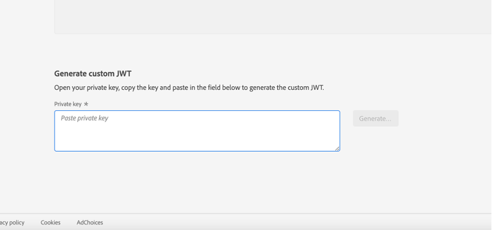

# Getting started with the Adobe Status API

There are several steps to take before using the Status APIs.

* Permissions: Configure permissions for the developer in the Adobe Admin Console.  
* API Client: Create a client configuration in the Adobe Developer Console.  
* Authentication: Obtain the necessary credentials to send data to Adobe.  

Once the setup is complete you can refer to Product hierarchy and Sample API calls from the left menu.

## Permissions

Before starting to use the Status API, you must make sure that your account has the correct permissions to send requests. Even if you successfully authenticate with an Adobe ID, you cannot make requests to Adobe unless your account contains the correct organization permissions.

Your Organization needs to have entitlements for at least one Adobe product to be able to access Adobe APIs.

Give a developer correct API permissions as a product profile admin:

1. Navigate to adminconsole.adobe.com.
2. Check the organization name in the top right to make sure that you are logged in to the correct company.
3. Click Products, then click on any Adobe product that you want to assign permissions to.
4. Select the desired product profile, or create a new product profile.
5. Under the Permissions tab, assign the desired permissions to the product profile.
6. Once the desired permissions are set, click the Developers tab.
7. Click Add Developer, and enter the user name or email address that you want to assign the permissions to.
8. Click Save.
See Managing developers in the Enterprise Admin user guide for more information.

## API Client

Once you are a developer for a Adobe product profile, you can create an Sttaus API client in the Adobe Developer Console.

1. Login to [Adobe Developer Console](https://developer.adobe.com/console/home)
2. Create a new project 
3. Add Adobe Status API to the project. Adobe Status API card will show up if there is at least one entitlement for Adobe products/services in your organization, and administrative permission for your org to create integrations.  

To learn more about creating projects in Adobe Developer Console, read the [Console getting started guide](https://developer.adobe.com/developer-console/docs/guides/getting-started/).
At this point, you decide how you want to authenticate with the API.

## Authentication

Status API needs JWT token for authentication. Follow the steps below to setup your access token -

1. Create a new service account (JWT) credential with key pair 
2. Generate key pair and download it. It contains all your app settings, along with the only copy of your private key. Since Adobe does not record your private key, make sure to securely store the downloaded file. 
3. Select product profile and save the configured Status API 
4. Once client Id and client secret created for you, follow these instructions to generate JWT access token  - https://developer.adobe.com/developer-console/docs/guides/authentication/JWT/ . This token is needed while accessing Adobe Status API. The token is valid for 24 hours after it has been issued.
    - To manually generate JWT access token from [Developer Console](https://developer.adobe.com/console/home), private key is mandatory. Go to your Project -> Service Account (JWT) -> Generate JWT -> Generate custom JWT, paste your private key there and click ‘Generate’. A JWT access token will be generated for you.  
    - To programmatically generate JWT access token, you will need client ID, technical account ID, Org ID, Client secret and private key. These can be obtained from Project -> Service Account (JWT). Sample codes to generate JWT access token - https://statusapi-doc-nld2.cloud.adobe.io/#section/Authentication. See API Endpoint Reference section for credentials to access the sample codes. 

Note: A project can include one or more services. In many cases, you will use the same client credentials to access multiple Adobe products and services.
